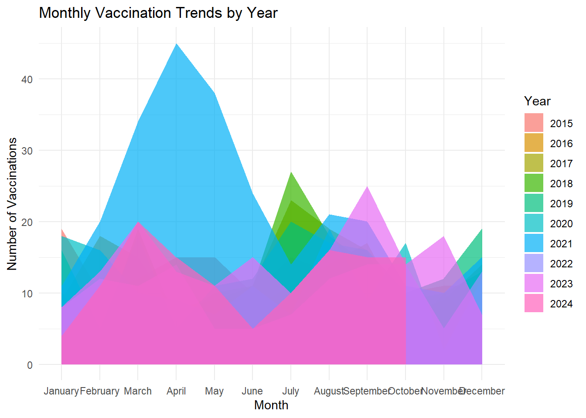
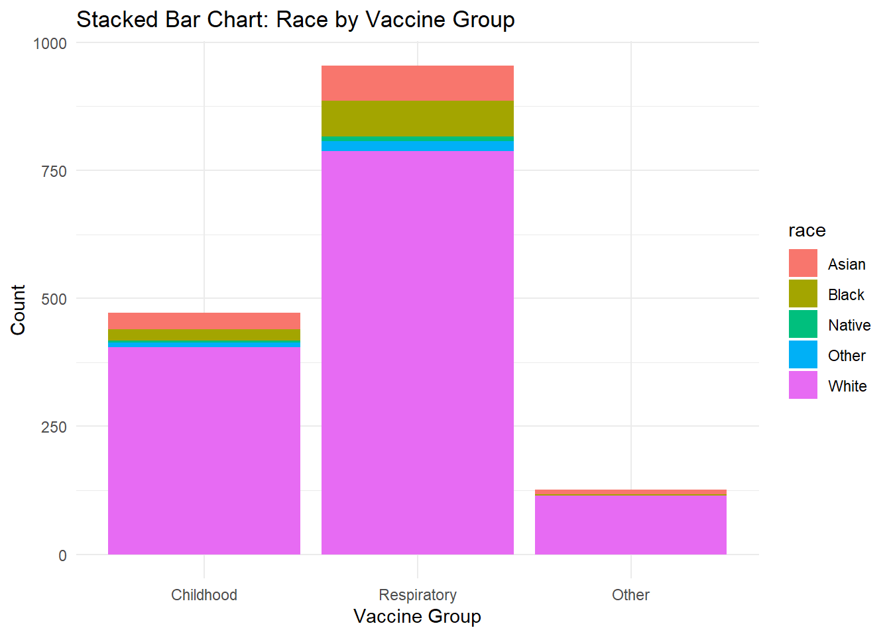
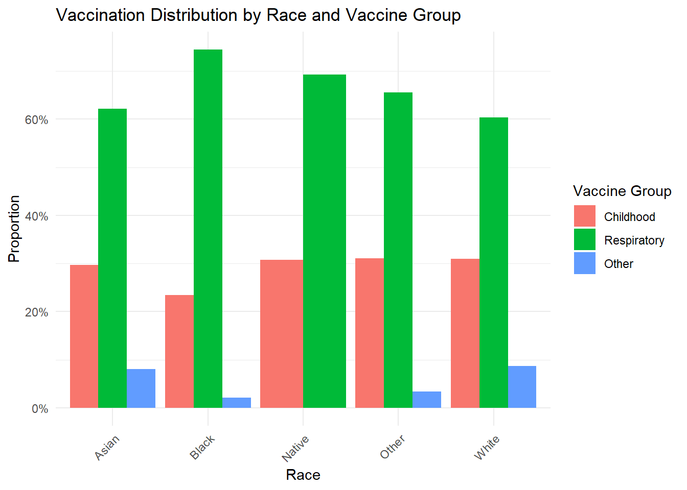
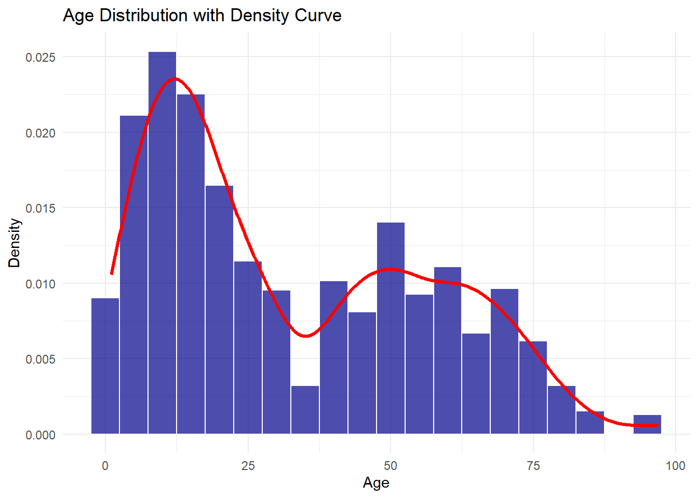
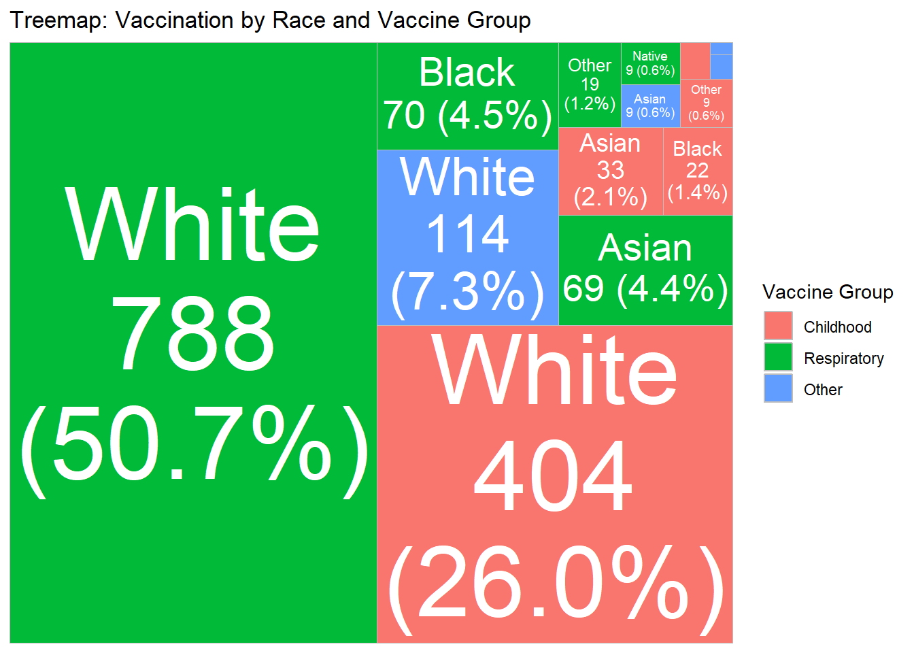

# 📊 Visualisation and Data Storytelling using R

**Website:** https://habtamuBizuayehu.github.io/Visualisation_story_telling/  
**Full Guide:** https://habtamuBizuayehu.github.io/Visualisation_story_telling/Visualisation.html

> A practical guide to **designing clear, reproducible visuals** for health monitoring and decision-making.  
> Author: [Habtamu Bizuayehu](https://habtamubizuayehu.com/) · [ORCID](https://orcid.org/0000-0002-1360-4909)

---

## 📌 Project Overview

This project demonstrates **data visualisation patterns** in R for health datasets, showing how to turn tidy data into clear and reproducible visuals.  

It emphasises:
- **Interpretability** → ordered factors (`forcats`), readable scales (`scales`), clean theming.  
- **Equity lenses** → stratified plots to reveal disparities.  
- **Transparency** → charts that make assumptions and uncertainty explicit.  

👉 The **full guide and examples** are available in the compiled HTML:  
[📖 Open Visualisation Guide](Visualisation.html)

---

## 🖼️ Preview of Figures

Below are sample outputs generated in this project:

### 1. Time Trends – Area Chart

### 2. Distribution Comparisons – Violin Plot

### 3. Categorical Comparisons – Bar Plot

### 4. Grouped Comparisons – Column Plot

### 5. Age Distribution – Histogram

### 6. Hierarchical Data – Treemap

---

## 🚀 Contents

- **Data Visualisation with `ggplot2`** → chart components, comparative plots, statistical overlays  
- **Interactive Visualisation** → Shiny apps, Plotly, Leaflet maps, DT tables  
- **Applied Examples** → vaccination uptake, breast cancer screening 

---

---

## 🔖 Tags / Keywords

#R #DataVisualisation #DataStorytelling #ggplot2 #Shiny #PublicHealthData  
#RStats #DataScience #DataAnalytics #HealthAnalytics #DataVisualizationInR  
#Tidyverse #Forcats #Scales #InteractiveVisualisation #ReproducibleResearch  
#OpenScience #Epidemiology #HealthDataStorytelling #Quarto
